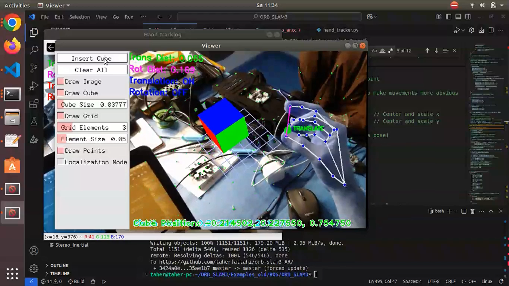

# AR Cube Manipulator with Hand Gestures

An augmented reality system that allows users to place and manipulate virtual 3D cubes using a single camera and hand gestures. The system combines ORB-SLAM3 for accurate camera tracking with MediaPipe hand tracking to enable intuitive interaction through pinch gestures.

## Demo Video
[](https://youtu.be/Tp8tu35jK3E)

## Features
- **Real-time hand gesture recognition** using MediaPipe
- **Two distinct pinch gestures**:
  - Thumb-index finger pinch for translating objects
  - Thumb-middle finger pinch for rotating objects
- **Augmented reality visualization** using ORB-SLAM3 and Pangolin
- **Planar surface detection** for placing virtual objects
- **Real-time visual feedback** with on-screen status information

## Hardware
- **Camera**: Logitech C922 Pro webcam

## System Architecture
The system consists of two main components:

1. **Hand Gesture Detector**: A ROS node that processes camera input to detect pinch gestures using MediaPipe.
2. **AR Visualizer**: Based on ORB-SLAM3, this component handles camera tracking, plane detection, and renders the augmented reality scene with virtual cubes.

### Communication Flow
```
Camera Input → Hand Gesture Detector → ROS Topics → AR Visualizer → Display
```

## Dependencies
- ROS (Robot Operating System)
- OpenCV 3.x
- MediaPipe
- ORB-SLAM3
- Pangolin

## Installation
Detailed installation instructions are available at: https://github.com/UZ-SLAMLab/ORB_SLAM3

### Running the System
1. Start ROS core
```bash
roscore
```

2. In a new terminal, start the hand gesture detector
```bash
python3 hand_tracker.py
```

3. In another terminal, start the AR visualizer
```bash
rosrun ORB_SLAM3 MonoAR ~/ORB_SLAM3/Vocabulary/ORBvoc.txt ~/ORB_SLAM3/Examples_old/Monocular/EuRoC.yaml
```

### Interaction Instructions
1. **Initialization**: Move the camera around to initialize SLAM tracking.
2. **Plane Detection**: Point the camera at a planar surface and press the "Insert Cube" button in the UI.
3. **Translation**: Use thumb-index finger pinch gestures to move the cube along the detected plane.
4. **Rotation**: Use thumb-middle finger pinch gestures to rotate the cube around its axes.

## Code Structure

### hand_tracker.py
Python script that processes camera input using MediaPipe to detect and track hand gestures, specifically pinch gestures. It publishes the following ROS topics:
- `/pinch_position`: 3D position of the translation pinch (thumb-index)
- `/pinch_active`: Boolean indicating if translation pinch is active
- `/rotation_pinch_position`: 3D position of the rotation pinch (thumb-middle)
- `/rotation_pinch_active`: Boolean indicating if rotation pinch is active
- `/camera/image_raw`: Processed camera image with visual feedback

### ros_mono_ar.cc
C++ source file that integrates the ROS topics from the pinch gesture detector with ORB-SLAM3. It subscribes to the gesture topics and passes the data to the ViewerAR class.

### ViewerAR.cpp and ViewerAR.h
These files implement the augmented reality visualization, including:
- Plane detection for placing virtual objects
- 3D cube rendering and manipulation
- Mapping 2D gestures to 3D transformations
- Visual status information overlay

## License
This project is released under the MIT License. Feel free to use, modify, and distribute for your own projects.

## Acknowledgements
- ORB-SLAM3: https://github.com/UZ-SLAMLab/ORB_SLAM3
- MediaPipe: https://ai.google.dev/edge/mediapipe/solutions/guide

## Contact
For questions or feedback, please contact:
**Email**: [taherfattahi11@gmail.com](mailto:taherfattahi11@gmail.com)